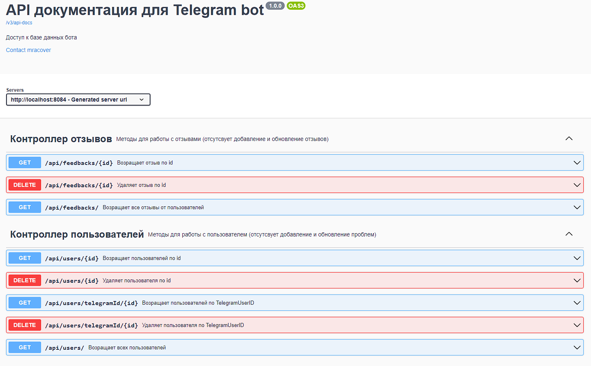

<h1 align="center">Feedbacks and problems telegram bot</h1> 
<h2 align="center">


</h2>

_____
<h2 align="center">Описание</h2>

Телеграм бот сделанный для абстрактного "интернет магазина". Принимает отзывы и сообщение о проблемах о товарах, и сохраняет в бд `postgres`.
Имеется **REST API** для взаимодейстовия с данными, которые оставили пользователи. <br>

Используется `Telegram bot API` для работы с телеграмом. Пример первоначальной настройки вы можете прочесть в 
[документации для java](https://core.telegram.org/bots/tutorial)<br> 

Присутствуют команды для удобной работы :point_down:

<div align="center">

</div>

_____

<h2 align="center">Как пользоваться? :hushed: </h2>

**Команды доступные пользователю:**
+ `/start` - Начало работы
+ `/problem` - Оставить проблему
+ `/feedback` - оставить отзыв
+ `/mydata` - Посмотреть ваши данные и все проблемы, отзывы
+ `/deletedata` - Удалить ваши данные
+ `/info` - Описание всех команд

В боте есть описание всех команд. Не переживайте :blush:

Демонстрация работы команды `/feedback`:


**Учтите, что только при первом использовании вас спросить имя и email. Они заносятся в базу 
и повторно спрашиваться не будут.**

_____

<h2 align="center">Технологии в проекте :sunny: </h2>


+ `Spring` (boot, data jpa, validation)
+ `Postgres` (PGadmin)
+ `Lombok`
+ `Slf4j` (логирование)
+ `Swagger` (Описание API)
+ `Telegram-bot-api`
+ `Maven`

______

<h2 align="center">Документация к API (Swagger ui) :page_facing_up: </h2>

При запущенном проекте, вы можете перейти на документацию API:
```http request
http://localhost:8084/swagger-ui/index.html
```



______

<h2 align="center">Сложности :weary: </h2>

В ходе создания `feedback` и `problem` команд возникли сложности в сохранении данных в БД. При выполнении команд,
необходимо было присылать пользователю поочередные сообщения и ждать ответа, а после всех ответов заносить данные в БД.

Необходимо было сделать состояние бота: 

Например, Пользователь вызывает команду `/feedback` (FEEDBACK состояние) -> спрашивается имя (FEEDBACK_NAME состояние) -> спрашивается email (FEEDBACK EMAIL состояние) и тд.

_____

<h2 align="center">Запуск проекта :fire: </h2>

В проект добавлены `Dockerfile` и `Docker-compose`. Вы можете легко запустить проект в контейнере и опробовать его. 
Для этого необходимо:

Упаковать проект вызвав в командной строке:

```
mvn package
```

И запустить контейнеры docker-compose:

```
$ docker-compose up -d
```

Либо просто запустить в среде разаботки.
____


